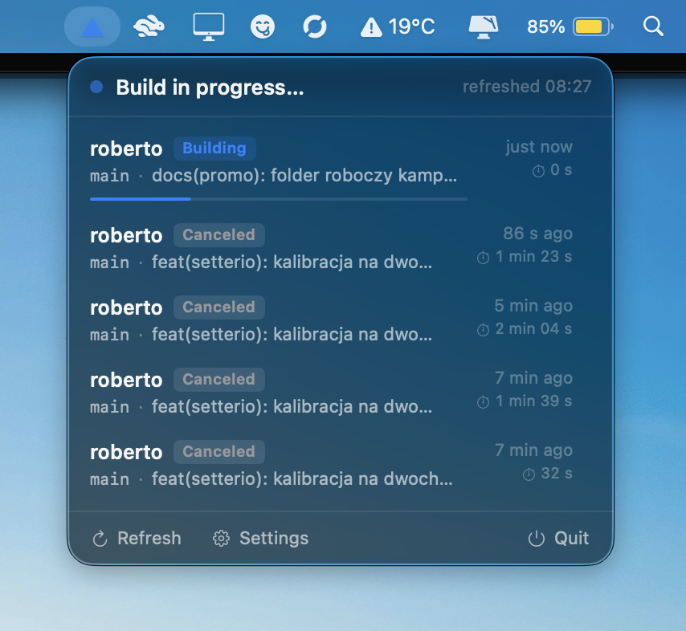
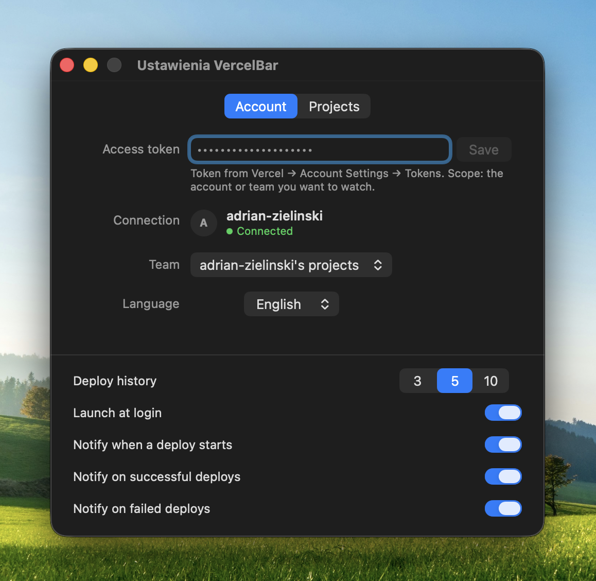
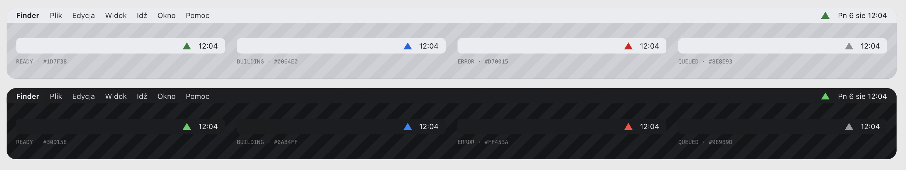
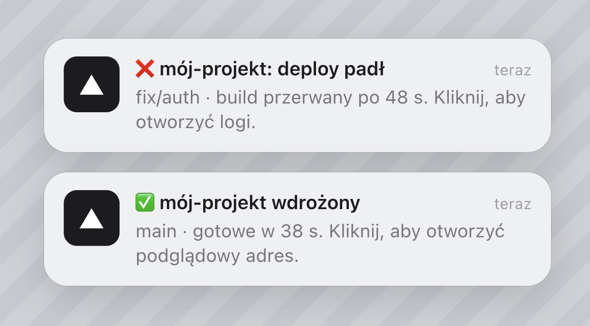

# ▲ VercelBar

**Your Vercel deploys, live in the macOS menu bar.**

A small triangle sits in your menu bar and shows the state of your deploys at a glance: green means everything shipped, pulsing blue means a build is running, red means a deploy failed. Click it for the details. You stop cmd-tabbing to the dashboard.

**⬇️ [Download VercelBar for macOS](../../releases/latest)**

## Features

- ✅ **Live status triangle** in the menu bar: green / pulsing blue / red / gray, driven by the worst state among your watched projects
- ✅ **Deploy feed**: every watched project keeps a row for its latest deploy, and older deploys fill the list to a depth you pick — 3, 5 or 10. Each row shows branch, commit message, relative time and a build timer that ticks every second while a build runs
- ✅ **Notifications with sound**: 🚀 when a deploy starts, ✅ when it ships (click opens the preview), ❌ when it fails (click opens the logs)
- ✅ **Teams**: watch your personal account or any team you belong to
- ✅ **Token lives in the Keychain**, never in a file
- ✅ **English + Polish**: follows your system language, or pick one in Settings and the UI switches instantly
- ✅ **Updates itself**: one click in the popover downloads the new release and relaunches on it
- ✅ **Light and dark mode**, respects Reduce Motion
- ✅ **Tiny native Swift app**: 1.4 MB on disk, zero dependencies, no Electron

## Screenshots

<p>
  
  
</p>

Menu bar states, light and dark:



Notifications:



## Install

**Homebrew**

```bash
brew tap adrian-zielinski/vercelbar https://github.com/adrian-zielinski/vercelbar
brew install --cask --no-quarantine vercelbar
```

**One command, no Homebrew**

```bash
curl -fsSL https://raw.githubusercontent.com/adrian-zielinski/vercelbar/main/install.sh | bash
```

The script downloads the latest release into Applications and launches it. Terminal downloads skip Gatekeeper's quarantine, so the app opens without the right-click dance.

**Manually**

1. Download `VercelBar.dmg` or `VercelBar.zip` from [Releases](../../releases/latest).
2. Drag `VercelBar.app` into your Applications folder.
3. On first launch: right-click → Open, then Open again. The app ships without a paid Apple signature; this dance happens once.

## Setup

1. Create a token at [vercel.com](https://vercel.com) → Account Settings → **Tokens**. Pick the account or team you want to watch as the scope.
2. Click the triangle → **Connect to Vercel** → paste the token.
3. Open the **Projects** tab and check the projects you care about.

VercelBar polls the Vercel API every 30 seconds, and every 10 seconds while a build runs. On API errors it backs off exponentially, up to 5 minutes. macOS will ask for notification permission on first launch and for keychain access after an app update; choose "Always Allow" and it stays quiet.

## Updates

Once a day VercelBar asks GitHub Releases whether a newer version exists — a single anonymous request, no account, no telemetry. When one is out, a bar shows up above the popover footer: click **Update** and the app downloads the release, checks that the bundle inside carries the right identifier and version, swaps itself in place (the old copy goes to the Trash) and relaunches on the new version. If any step fails, the release page opens in your browser and the running app stays exactly as it was. Settings → Account has a **Check for updates** button for the impatient.

The app is signed ad-hoc, so macOS treats every new build as a new app: right after an update it asks once for keychain access to read your token. Choose "Always Allow" and it stays quiet.

## Uninstall

1. Quit VercelBar from the popover.
2. Delete `VercelBar.app` from Applications.
3. Remove the login item in System Settings → General → Login Items, if you enabled it.
4. VercelBar keeps your token in the login keychain. To remove it:

```bash
security delete-generic-password -s pl.zielinski.vercelbar
```

## Build from source

Requires Swift 6+ (Command Line Tools from Xcode 16 or newer). No third-party dependencies.

```bash
git clone https://github.com/adrian-zielinski/vercelbar.git
cd vercelbar

# Build build/VercelBar.app and build/VercelBar.zip
./Scripts/build-app.sh

# Optional: pack build/VercelBar.dmg from the freshly built zip
./Scripts/make-dmg.sh

# Run in place (dev mode; shows a Dock icon that the bundled app doesn't have)
swift run vercelbar

# Core test suite
swift run vercelbar-tests
```

## How it works

VercelBar polls Vercel's REST API (`/v9/projects`, `/v6/deployments`) over HTTPS with your token, keeping at most four requests in flight. A pure notification engine turns state transitions into events and dedupes them per deployment, so a flapping API never notifies twice. The UI is plain SwiftUI with a `MenuBarExtra`; the token sits in the login keychain and gets cached in memory after the first read.

Known limits: the project list caps at 100 entries (no pagination yet). Because every watched project is guaranteed a row, watching more projects than your history depth makes the feed longer than that number — the guarantee wins, so a red triangle always has something to click.

## Languages

The app ships with English and Polish. By default it follows your system language; Settings → Account → Language lets you pin one, and the whole UI redraws immediately — no restart. Strings live in [`Sources/VercelBarKit/L10n.swift`](Sources/VercelBarKit/L10n.swift); pull requests with new languages are welcome.

## License

[MIT](LICENSE).

